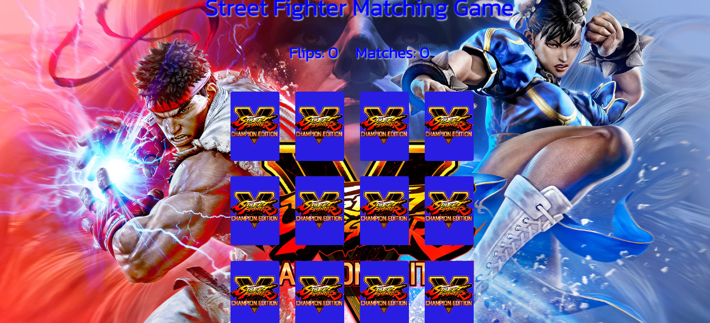

# Street Fighter Matching Game

## Overview
Street Fighter Matching Game is a memory matching game featuring characters from the Street Fighter V series. The objective of the game is to flip pairs of cards to reveal matching characters.

## Features
- Card flipping mechanism
- Matching pairs of cards
- Keeping track of flips and matches
- Resetting the game
- Audio feedback for matches

## Technologies Used
- HTML
- CSS
- JavaScript
- Underscore.js

## Setup Instructions
1. Clone the repository.
2. Open `index.html` in a web browser.
3. Press the "Reset" button to play again.

## File Structure
- README.md
- index.html
- style.css
- script.js
- tests.js
- audio/
- img/

## Additional Notes
- The game may experience issues on older browsers.
- Future enhancements may include adding more characters and increasing the total number of cards to match.

## Credits
- Background image sourced from [https://store.steampowered.com/app/1172540/Street_Fighter_V__Champion_Edition_Special_Wallpapers/].
- Audio files sourced from [https://www.sounds-resource.com/pc_computer/streetfighterv/].
